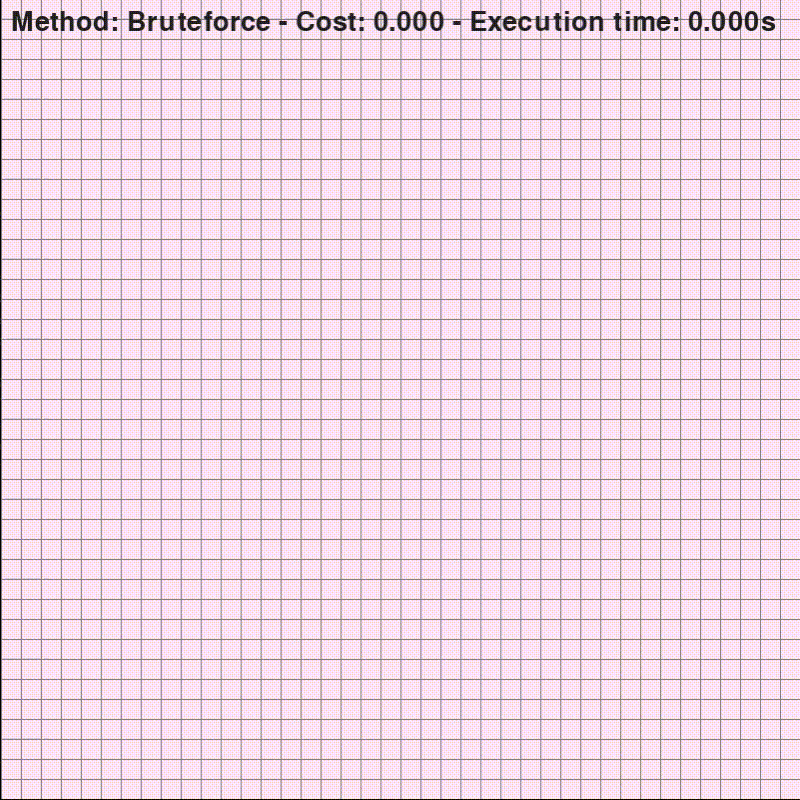

# TSP 
The travelling salesman algorithm implementation/playground (:

### Why
This was one of the algorithms that I never really fully understood when I came across it in college, 
so I decided to implement it now.

### Adapted from the [Astar](https://github.com/RauanBPK/Astar) project
The code may look a bit Frankensteinian

### What can it do?
- The user can set (and unset with right click) some nodes representing the cities. *(mouse r and l buttons)*

- For now, the cost is the Euclidean distance (simple distance between two points)*

- The only solver now is Bruteforce with memoization. I'll add more solvers with different algorithms later on

- Show info (cost and execution time) on the screen *("i")*
### Demo

